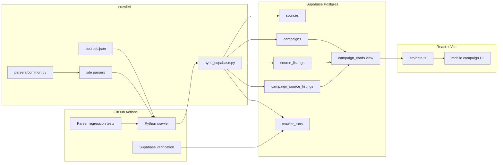
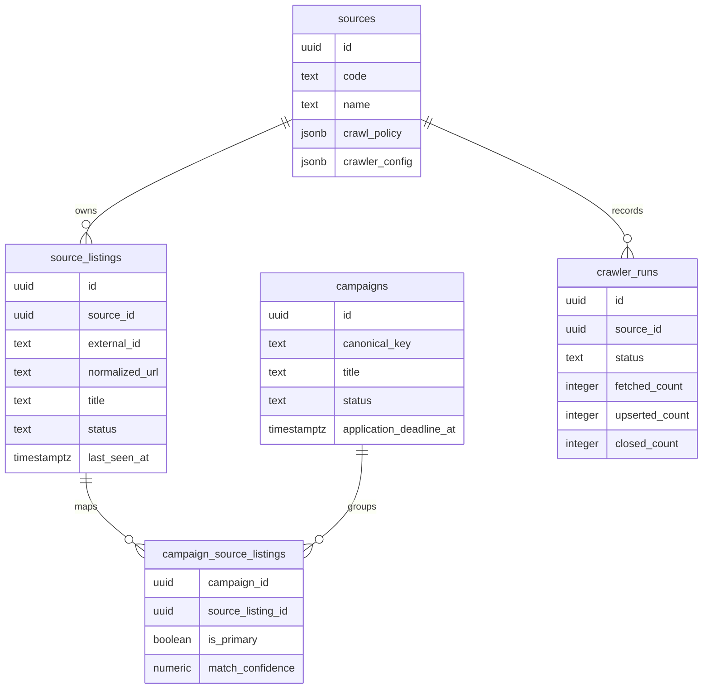
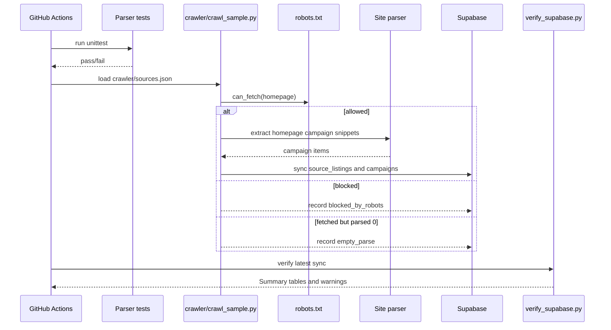
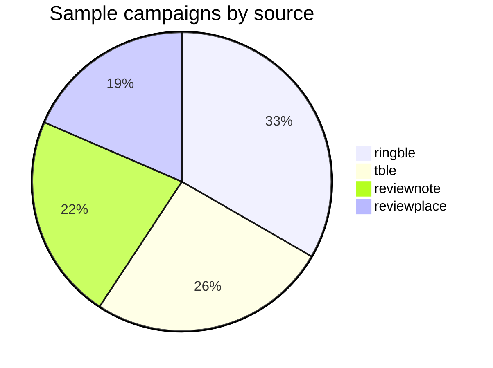
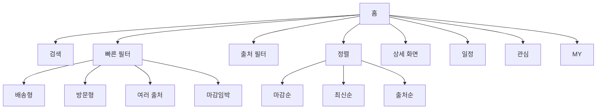

# Reviewer

여러 체험단 사이트의 캠페인 정보를 한 화면에서 탐색하는 MVP입니다. Python 크롤러가 GitHub Actions에서 주기적으로 homepage campaign snippet을 수집하고, Supabase에 저장된 대표 캠페인 카드를 React 프론트엔드에서 보여줍니다.

현재 방향은 서버 비용을 최소화하는 구조입니다.

- 수집: Python crawler on GitHub Actions
- 저장: Supabase Postgres
- 화면: React + Vite static frontend on GitHub Pages
- 백엔드 서버: 없음

## 현재 구현 범위

| 영역 | 구현 내용 |
| --- | --- |
| 크롤러 | source별 homepage 수집, robots 확인, parser 분리, `empty_parse` 분리 |
| Parser | `reviewnote`, `ringble`, `reviewplace`, `gangnammatzip`, `tble` 모듈화 |
| 데이터 동기화 | Supabase `sources`, `source_listings`, `campaigns`, 연결 테이블 upsert |
| 대표 카드 | `campaign_cards` view로 active source 기준 대표 카드 제공 |
| 운영 검증 | crawl 결과 Summary, source/card coverage, orphan campaign close |
| 프론트 | 모바일 앱형 UI, 검색, 빠른 필터, source 필터, 정렬, 상세 화면 |
| 배포 | GitHub Pages 자동 배포 |

## Architecture



## Data Model



## Crawler Flow



## Sample Data Snapshot

아래 수치는 `data/samples/campaigns.sample.json` 기준입니다.

| 지표 | 값 |
| --- | ---: |
| 생성 시각 | `2026-07-01T10:05:19.740880+00:00` |
| 총 수집 캠페인 | 108 |
| 성공 소스 | 4 |
| robots 차단 소스 | 1 |
| 이미지 포함 | 108 / 108 |
| 마감일 포함 | 100 / 108 |
| 보상 포함 | 108 / 108 |
| 위치 포함 | 45 / 108 |



### Source Status

| Source | Status | Items | Note |
| --- | --- | ---: | --- |
| `reviewnote` | `ok` | 24 | homepage snippets |
| `ringble` | `ok` | 36 | homepage snippets |
| `reviewplace` | `ok` | 20 | homepage snippets |
| `tble` | `ok` | 28 | homepage snippets |
| `gangnammatzip` | `blocked_by_robots` | 0 | request skipped |

### Field Coverage

| Field | Count | Coverage |
| --- | ---: | ---: |
| Image | 108 / 108 | 100.0% |
| Reward | 108 / 108 | 100.0% |
| Deadline | 100 / 108 | 92.6% |
| Location | 45 / 108 | 41.7% |

### Parsed Tags

| Benefit tag | Count |
| --- | ---: |
| `visit` | 39 |
| `delivery` | 13 |
| `purchase_review` | 11 |
| `reporter` | 2 |

| Platform tag | Count |
| --- | ---: |
| `instagram` | 16 |
| `blog` | 11 |
| `receipt` | 3 |
| `naver_clip` | 2 |

## Frontend Features



프론트엔드는 `campaign_cards` view를 우선 조회합니다. Supabase 브라우저 env가 없거나 요청에 실패하면 `public/data/campaigns.sample.json` 샘플 데이터로 fallback합니다.

## Project Structure

```text
.
├── .github/workflows/
│   ├── crawl-campaigns.yml      # scheduled/manual crawler workflow
│   └── deploy-frontend.yml      # GitHub Pages deploy workflow
├── crawler/
│   ├── crawl_sample.py          # crawl orchestration, robots check, payload output
│   ├── sources.json             # source config and parser names
│   ├── sync_supabase.py         # Supabase upsert and stale cleanup
│   ├── verify_supabase.py       # Actions Summary and quality checks
│   ├── parsers/
│   │   ├── common.py            # shared homepage parser primitives
│   │   ├── reviewnote.py
│   │   ├── ringble.py
│   │   ├── reviewplace.py
│   │   ├── gangnammatzip.py
│   │   └── tble.py
│   └── tests/
│       └── test_parsers.py      # parser regression tests
├── data/samples/
│   └── campaigns.sample.json
├── docs/
│   ├── crawler-operations.md
│   ├── data-model.md
│   ├── frontend-mvp.md
│   └── source-ranking.md
├── src/
│   ├── data.ts                  # Supabase/sample data loader
│   ├── main.tsx                 # React UI
│   ├── styles.css
│   └── types.ts
└── supabase/
    ├── schema.sql
    ├── seed_sources.sql
    └── migrations/
```

## Local Development

Frontend:

```bash
pnpm install
cp .env.example .env.local
pnpm run dev
```

`.env.local`에는 브라우저에 노출 가능한 Supabase anon key만 넣습니다.

```bash
VITE_SUPABASE_URL=https://your-project.supabase.co
VITE_SUPABASE_ANON_KEY=your-anon-or-publishable-key
```

서비스 role key는 프론트엔드에 넣지 않습니다. GitHub Actions의 크롤러 동기화에만 사용합니다.

Build:

```bash
pnpm run build
```

Parser tests:

```bash
python3 -m unittest discover -s crawler/tests
```

Dry-run Supabase mapping:

```bash
python3 crawler/sync_supabase.py --dry-run --input data/samples/campaigns.sample.json
```

## GitHub Actions

### Crawl campaign sources

`.github/workflows/crawl-campaigns.yml`

1. Python setup
2. Parser regression tests
3. homepage campaign snippet crawl
4. Supabase sync
5. Supabase verification
6. crawl artifact upload

필요한 GitHub Secrets:

- `SUPABASE_URL`
- `SUPABASE_SERVICE_ROLE_KEY`

### Deploy frontend

`.github/workflows/deploy-frontend.yml`

`main` 브랜치에 프론트 변경이 push되면 GitHub Pages로 배포합니다.

필요한 GitHub Secrets:

- `SUPABASE_URL`
- `SUPABASE_ANON_KEY`

`SUPABASE_ANON_KEY`가 없으면 배포된 화면도 샘플 데이터로 동작합니다.

## Crawling Policy

- `robots.txt`가 막는 URL은 요청하지 않습니다.
- 차단된 source는 `blocked_by_robots`로 기록하고 Supabase source policy 후보로 남깁니다.
- homepage에서 fetch는 성공했지만 parser 결과가 0건이면 `empty_parse`로 기록합니다.
- `ok`이고 item count가 1개 이상인 source만 stale listing cleanup 대상입니다.
- 상세 페이지 대량 fetch가 필요하면 공식 API/RSS, 제휴, 허가, 수동 등록을 먼저 검토합니다.
